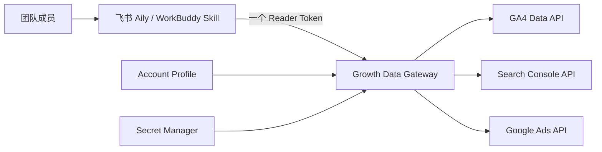

# Growth Data Reader Skill

> 一个 Profile、一次 Google OAuth、一个 Reader Token，让飞书 Aily 与 WorkBuddy 统一读取 GA4、Google Search Console 和 Google Ads。

[](https://developers.google.com/analytics/devguides/reporting/data/v1)
[](https://developers.google.com/webmaster-tools)
[](https://developers.google.com/google-ads/api)
[](docs/installation.md)
[](LICENSE)

## 项目简介

Growth Data Reader Skill 将三个原本分散的数据读取能力合并为一个团队数据入口：

| 数据源 | 主要能力 |
|---|---|
| GA4 | 流量、渠道、Campaign、落地页、事件、漏斗、电商、收入、设备与地区 |
| GSC | 点击、曝光、CTR、排名、搜索词、页面、Sitemap、URL Inspection |
| Google Ads | 花费、点击、展示、Campaign、搜索词、转化、CPA、ROAS |

用户可以直接提问：

- 自然搜索点击下降来自需求、排名还是 CTR？
- Google Ads 花费增长是否带来了 GA4 收入增长？
- 哪些广告落地页有点击但没有有效 Session 或 Purchase？
- 品牌词、非品牌词、付费搜索和自然搜索分别贡献多少高质量流量？

## 一句话迁移账户

复制 [Browser Use 一键账户发现 Prompt](prompts/browser-use-account-discovery.md)，只填写品牌名称和网站。支持浏览器操作的智能体会在已登录 Google 会话中只读收集：

- GA4 Account、Property、Stream、时区和币种；
- GSC Property 与权限；
- Google Ads Customer、MCC、时区、币种与 API Access Level；
- Google Cloud Project 与所需 API 状态；
- 最终生成标准 `account-profile.json` 和缺失权限报告。

Prompt 不读取密码、Cookie、OAuth Token 或 Developer Token。Google OAuth 仍需要用户本人点击一次授权。

## 通用首次使用 Prompt

安装并连接 Gateway 后，用户只需发送：

```text
读取当前 Growth Data Profile，分别验证 GA4、GSC 和 Google Ads 连接。成功后查询最近 7 个完整日的 GA4 sessions、engagedSessions、ecommercePurchases 与 purchaseRevenue，GSC clicks、impressions、CTR 与 position，Google Ads cost、clicks、conversions 与 conversionValue。按日期对齐输出，并说明三平台时区、归因和数据口径差异。不要显示任何 Token、Cookie、OAuth 凭据或认证请求头。
```

迁移到新账户时，先运行 Browser Use 账户发现 Prompt 生成 Profile；部署者只需替换服务端 Profile 与授权，不需要重做 Skill。

## 标准化架构



Skill 不保存账户 ID。Gateway 从 `ACCOUNT_PROFILE_JSON` 固定三个账户，调用方无法通过请求切换 Property 或 Customer。

## Account Profile

```json
{
  "profileId": "example-brand-us",
  "displayName": "Example Brand US",
  "website": "https://example.com",
  "ga4": {"propertyName": "properties/123456789"},
  "gsc": {"siteUrl": "sc-domain:example.com"},
  "googleAds": {
    "customerId": "1234567890",
    "loginCustomerId": "0987654321"
  }
}
```

完整示例见 [account-profile.example.json](profiles/account-profile.example.json)。

## 安装包

前往 [Releases](https://github.com/The-AlexLiu/Growth-Data-Reader-Skill/releases/latest) 下载：

| 平台 | 安装包 |
|---|---|
| 飞书 Aily | `growth-data-reader-aily-v1.0.0.skill` |
| WorkBuddy | `growth-data-reader-workbuddy-v1.0.0.zip` |

安装步骤见 [双平台安装](docs/installation.md)，账户迁移见 [迁移指南](docs/migration.md)。

## 部署概要

统一 Gateway 使用：

```text
ACCOUNT_PROFILE_JSON=<非敏感账户 Profile>
GOOGLE_OAUTH_CREDENTIALS_JSON=<组合 OAuth Secret>
GOOGLE_ADS_DEVELOPER_TOKEN=<Developer Token Secret>
GROWTH_DATA_READER_TOKEN=<团队 Reader Token Secret>
```

组合 OAuth Scope：

```text
analytics.readonly
webmasters.readonly
adwords
cloud-platform
```

完整步骤见 [Gateway 部署](docs/deployment.md)。

## 安全边界

- GitHub、Skill、Prompt、Profile 和 Release 均不包含真实 Token。
- 一个部署绑定一个 Profile，不能通过查询覆盖账号 ID。
- Google Ads 只允许 GAQL SELECT；GA4 和 GSC 只开放读取接口。
- 不提供预算、广告、GTM、GSC、Sitemap、索引或账户权限修改能力。
- Aily/WorkBuddy 必须使用项目或团队级持久化 Secret，避免会话重启后 Token 丢失。

## 项目结构

```text
.
├── services/growth-data-gateway/  # 三渠道统一只读 Gateway
├── skills/                        # Aily 与 WorkBuddy Skill
├── profiles/                      # 非敏感 Profile 示例
├── prompts/                       # Browser Use 一键账户发现 Prompt
├── docs/                          # 部署、迁移、安全和安装说明
├── scripts/build_packages.py      # 可复现打包
└── dist/                          # Release 安装包
```

## 作品集亮点

- 将三个平台、三个 Token、多个固定 ID 收敛为一个标准 Account Profile。
- 用一段 Browser Use Prompt 完成跨平台账户发现与迁移准备。
- 同时支持飞书 Aily 和 WorkBuddy，且凭据跨会话持久化。
- 保留三平台各自的时区、归因和数据口径，不做错误的指标混合。
- 提供只读安全边界、单元测试、可复现打包和迁移验收标准。

## License

[MIT](LICENSE)
